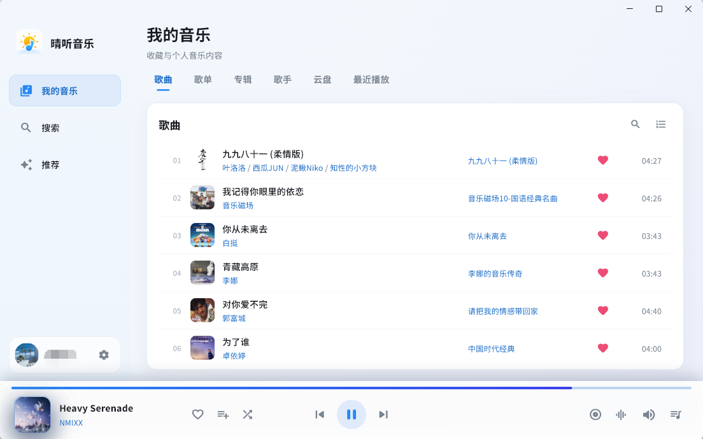
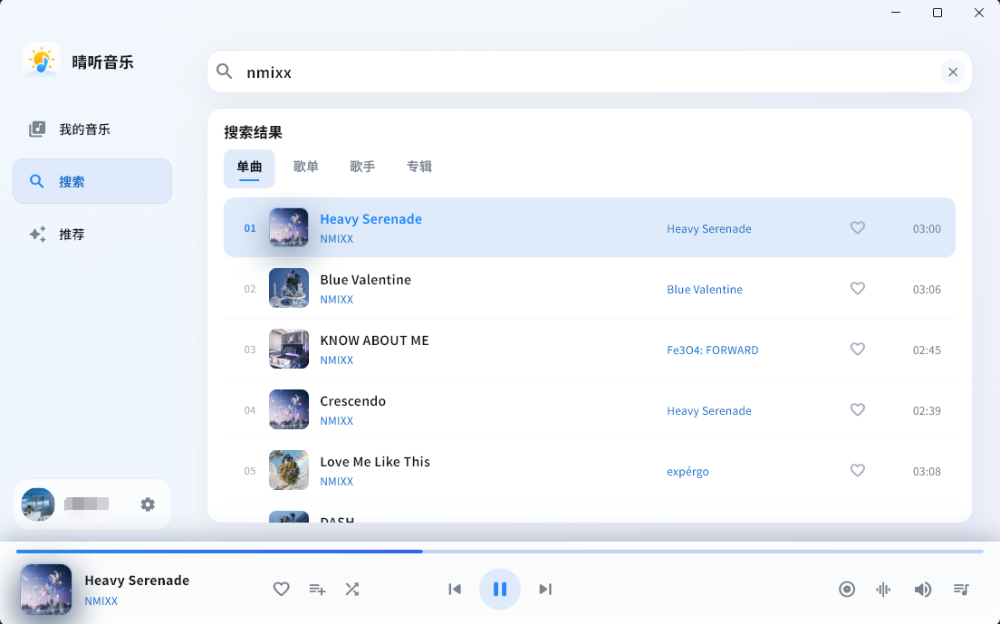
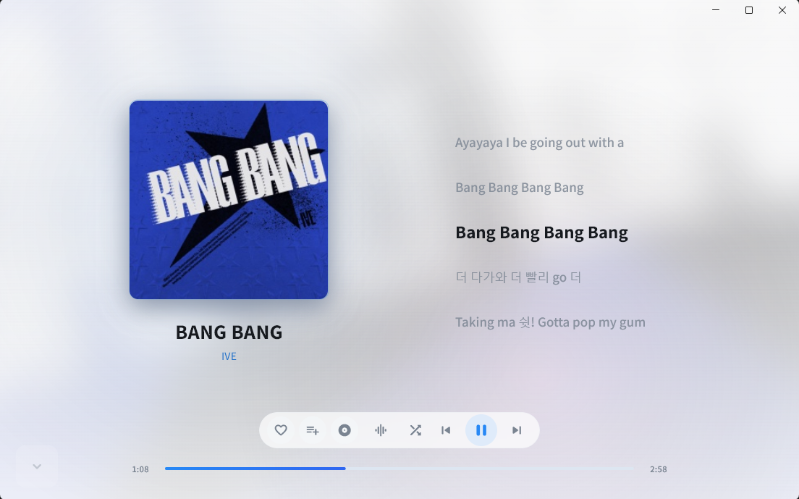
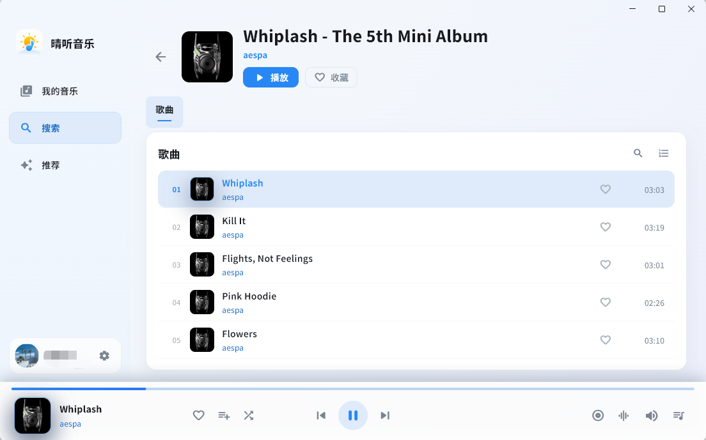
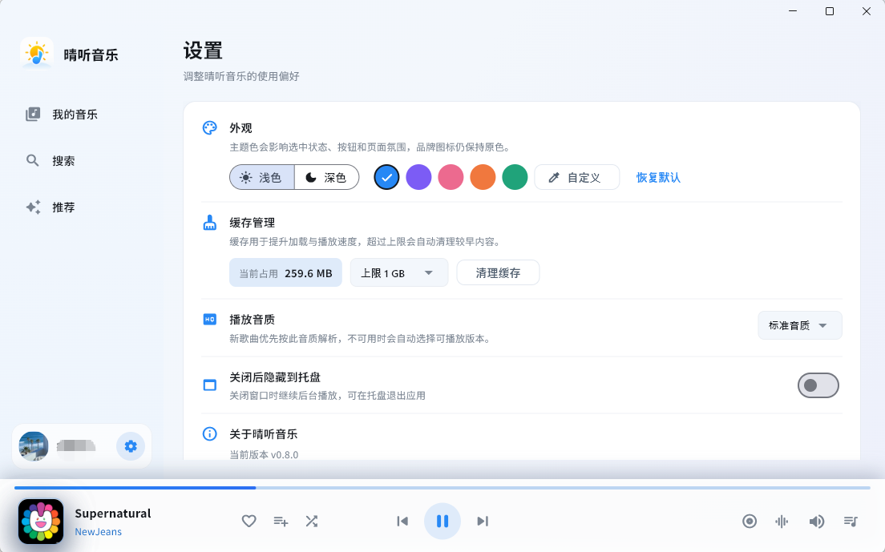

<div align="center">
  
  <h1>晴听音乐</h1>
  <p>搜索够直接，推荐有分寸，播放更顺手的 Windows 音乐播放器。</p>
  <p>
    <a href="https://github.com/bingjiu-lei/QingTingMusic/releases/latest">下载最新版</a>
    ·
    <a href="#界面预览">界面预览</a>
    ·
    <a href="https://github.com/bingjiu-lei/QingTingMusic/issues">问题反馈</a>
  </p>
</div>

---

晴听音乐把个人音乐库、搜索、每日推荐和私人 FM 放在一套安静的桌面界面里。

知道想听什么时，直接搜索；不知道听什么时，让每日推荐或私人 FM 接上。没有瀑布流，没有资讯，也不需要在一堆入口里找播放键。

> 当前仍处于测试阶段，功能与接口可能继续调整。

## 这次为什么不一样

- **界面重新设计**：标题栏、侧栏、内容区和播放器融成连续背景，深浅模式都更完整。
- **颜色由你决定**：提供预设主题色和自定义取色，按钮、进度和选中状态会随主题同步变化。
- **推荐不做信息流**：每日推荐负责一整天的歌单，私人 FM 用频道与偏好持续补歌。
- **搜索更像音乐应用**：联想搜索、最近搜索、结果分类和清除操作更轻、更快。
- **播放器真正顺手**：控制重新分组，进度条更清晰，音量浮层不乱跑，多歌手可以分别进入主页。
- **随机播放记得来路**：快速切歌后点“上一首”，会回到刚才实际听过的歌曲。

## 界面预览

### 我的音乐

收藏歌曲、歌单、专辑、歌手、云盘和最近播放集中管理。



### 搜索

搜索歌曲、歌手、歌单和专辑，支持联想与最近搜索。



### 播放页

沉浸查看封面与歌词，保留必要的播放、收藏、音质和队列控制。



### 歌手 / 专辑详情

从歌曲进入对应歌手或专辑；多位歌手可以逐个选择，不再把整串名字一起搜索。



### 设置

切换深浅模式和主题颜色，管理缓存、播放音质、后台行为与应用更新。



## 主要功能

- 酷狗账号扫码与手机验证码登录
- 搜索歌曲、歌手、歌单和专辑
- 每日推荐完整歌单
- 私人 FM：红心、小众、速览频道，口味、风格、探索偏好
- 私人 FM 自动续队，切换频道或偏好后即时换一批
- 收藏歌曲、创建歌单、收藏歌单与专辑
- 查看关注歌手、云盘歌曲和最近播放
- 标准、HQ、无损等可用音质切换
- 顺序、列表循环、单曲循环和带历史记录的随机播放
- 播放队列、歌词、进度拖动、音量与后台播放
- 本地缓存与播放状态恢复
- 浅色、深色、预设主题色与自定义取色

## 下载与安装

前往 [Releases](https://github.com/bingjiu-lei/QingTingMusic/releases/latest) 下载 Windows 安装包：

```text
QingTingMusic-Setup-v版本号-x64.exe
```

支持 Windows 10 和 Windows 11 64 位系统。已安装旧版本时，直接运行新安装包即可覆盖升级。

> 安装包暂未进行数字签名。如果 Windows SmartScreen 显示提示，请点击“更多信息”，再选择“仍要运行”。

## 使用说明

1. 打开晴听音乐，在左下角登录酷狗账号。
2. 从“我的音乐”播放收藏内容，或在“搜索”中直接找歌。
3. 想换换口味时进入“推荐”，选择每日推荐或私人 FM。
4. 在“设置”中调整主题、音质、缓存上限和后台行为。
5. 新版本可以直接覆盖安装；完整卸载会同时清理晴听音乐用户数据。

## 常见问题

**登录后看不到歌单或收藏？**

确认登录账号正确并重新进入对应栏目。网络刷新失败时，应用会尽量保留已有缓存，不会直接清空列表。

**播放时提示“无版权或需付费”？**

当前账号、地区或音质下可能没有可用播放地址，可以尝试同名歌曲的其他版本。

**私人 FM 会不会只重复最初几首？**

不会。接近队尾时会自动请求下一批；切换频道或偏好也会立即重新加载。

**覆盖安装会丢失数据吗？**

不会。覆盖升级会保留登录信息、设置、缓存和播放记录，完整卸载才会清理。

## 关于这个项目

晴听音乐是一个个人学习与技术实践项目，使用 Flutter 开发，目前只维护 Windows 桌面端。

项目希望把搜索、个人音乐库、克制推荐和稳定播放做得直接、舒服、可靠，而不是追求入口最多。

## 反馈

遇到问题或有建议，可以前往 [Issues](https://github.com/bingjiu-lei/QingTingMusic/issues)。反馈时建议附上：

- Windows 版本
- 晴听音乐版本
- 出现问题前进行的操作
- 错误提示或截图

## 项目声明

本项目仅用于个人学习和技术研究，不提供或存储音乐资源。

音乐、账号及相关数据通过酷狗官方接口获取。请遵守平台规则，尊重音乐版权并支持正版内容，请勿用于商业用途或违法行为。

<details>
<summary>参与开发</summary>

```powershell
flutter pub get
flutter run -d windows
```

提交代码前请运行：

```powershell
.\scripts\verify.ps1
```

</details>
